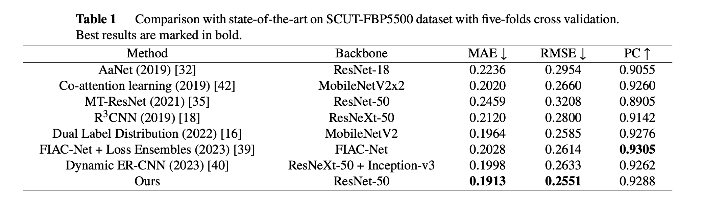

# A Ranking Information Based Network for Facial Beauty Prediction


## Pipeline
<p align="center"></p>


## Performances
<p align="center"></p>


## Codes

### Requirements

- Test on NVIDIA TITAN GPU, Ubuntu 18.04.6, Python3.8, CUDA 12.0 and PyTorch 1.12.0

```
pip install -r requirements.txt
```


### Dataset

Get ready for the SCUT-FBP5500 dataset from [here](https://github.com/HCIILAB/SCUT-FBP5500-Database-Release).


### Training

Start training with the required parameters `data_dir`.

```
python train.py --data_dir YOUR_DATASET_DIR
```

Furthermore, you can set other parameters.

- Load pre-trained model before training by using `--load_from`

- Set the directory to store the state-dict by using `--checkpoint`
- Set the hyperparameter of losses by using `--param`
- Set the training batch size by using `--batch_size`
- Set the training epoch by using `--epoch`
- Set the training method, including 6-4 and cross_validation, by using `--method`


### Testing

Start testing with two required parameters `data_dir` and `load_from`.

```
python test.py --data_dir YOUR_DATASET_DIR --load_from YOUR_WEIGHT_OF_MODEL
```

Note that you only need to set the `load_from` parameter to be the same directory of the `checkpoint` which  is set in training phase, unless you have renamed the state-dict file or moved it to somewhere else.

